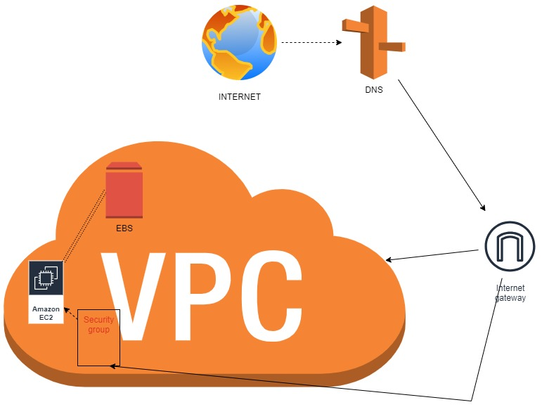

# 🌐 Projeto de Arquitetura AWS: Site Dinâmico  

Este repositório documenta a arquitetura de um **site dinâmico hospedado na AWS**, utilizando serviços essenciais de computação e rede.  

---

## 🎯 Objetivos  

- Compreender os principais componentes da AWS envolvidos na construção de um site dinâmico.  
- Explorar como cada serviço se integra para formar uma solução escalável e segura.  
- Documentar de forma clara o fluxo de funcionamento da arquitetura.  

---

## 📝 Componentes da Arquitetura  

Este projeto utiliza os seguintes serviços da AWS, cada um com um papel específico no funcionamento da aplicação:  

- **🌍 Internet:** Representa os usuários acessando o site de qualquer lugar do mundo.  
- **🔗 Serviço de Domínio (Route 53):** Direciona o nome de domínio (ex.: www.exemplo.com) para o servidor na AWS.  
- **🚪 Gateway de Internet (Internet Gateway):** Permite que o tráfego da internet pública entre na sua rede privada (VPC).  
- **☁️ VPC (Sua Rede na Nuvem):** Uma rede virtual isolada e segura na nuvem da AWS onde seus recursos estão localizados.  
- **🛡️ Firewall Virtual (Security Group):** Atua como firewall, controlando o tráfego que pode chegar à instância EC2.  
- **💻 Servidor Web (EC2):** Máquina virtual que hospeda o código e os arquivos do site dinâmico.  
- **💾 Disco de Armazenamento (EBS):** O disco rígido virtual conectado ao servidor EC2 para armazenamento de dados persistentes.  

---

## 📂 Estrutura do Repositório  

- **README.md** → Descrição do projeto e da arquitetura.  
- **/images** → Pasta para armazenar diagramas ou capturas de tela.  

---

## 📊 Diagrama de Arquitetura  

O diagrama abaixo ilustra os componentes e sua interação na arquitetura do site dinâmico hospedado na AWS:  

  

---

## 🔄 Fluxo de Tráfego  

1. O usuário acessa o site pelo navegador através do domínio configurado no **Route 53**.  
2. O **Internet Gateway** direciona o tráfego da internet para a **VPC**.  
3. O **Security Group** atua como firewall, filtrando o tráfego que pode alcançar a instância.  
4. O servidor **EC2** processa a requisição e acessa os dados armazenados no **EBS**.  
5. A resposta é enviada de volta ao usuário, exibindo o site dinâmico.  

---

## ✅ Conclusão  

Este projeto reforça os fundamentos de arquitetura em nuvem com **AWS**, demonstrando como serviços essenciais como **VPC, EC2, EBS e Route 53** se conectam para construir um site dinâmico seguro, escalável e funcional.  

---

🔗 *Projeto desenvolvido como parte da trilha de aprendizado em AWS.*  
